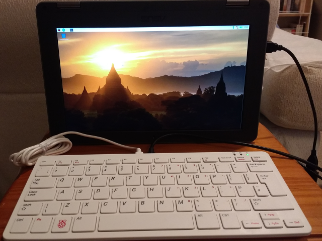

# Pi-View
A handy full-screen video capture device input preview page.

Just a single, basic HTML page with a simple video element in the middle that can be set to full screen.

Intended for turning a laptop / Chromebook into a handy monitor to use with a [Raspberry Pi](https://www.raspberrypi.org/) and a cheap (£20) [HDMI-to-USB](https://www.amazon.co.uk/gp/product/B08F9PJ9Q1/ref=ppx_yo_dt_b_asin_title_o04_s00) adaptor. You'll also probably need a micro-to-full-size [HDMI cable](https://www.raspberrypi.org/products/micro-hdmi-to-standard-hdmi-a-cable/) (£8) to go from the Raspberry Pi to the USB adaptor.

The Raspberry Pi is intended to be plugged into a monitor or TV. If you only have a laptop or Chromebook available you can now use that instead.

You can find the live page [here](https://www.sansay.co.uk/pi-view). The page will ask you for permission to view your camera when it loads. You will probably have multiple cameras to select from, just press the "Change Input" button to switch to the next camera in the list.

Unlike most camera preview windows, this video element doesn't mirror-flip the video by default, although there is a button to do that if you want.

## Notes

I've tested the USB adaptor linked to on Amazon above, it works well with the [Raspberry Pi 400](https://www.raspberrypi.org/products/raspberry-pi-400/) kit (which comes complete with a micro-to-full-size HDMI cable, so you just need to get the [USB adaptor](https://www.amazon.co.uk/gp/product/B08F9PJ9Q1/ref=ppx_yo_dt_b_asin_title_o04_s00)), displaying 1920 x 1080 ("Full HD") resolution on a Chromebook and Windows laptop. Many other very similar devices are available on Amazon / eBay / etc.

The getUserMedia component on the page sets a high "ideal" screen resolution constraint so you should get up to a 4K display - the Raspberry Pi supports outputting 4K, but the adaptor used here scales that down to 1080p, and of course you'd need a laptop or Chromebook with a 4K display.

There's a little bit of lag when using the mouse and keyboard on the Pi - usable for the command line and general point-and-click usage, but probably not great for gaming.

Requires a browser that supports getUserMedia, so should work on most reasonably modern browsers but will not work on an iPad.
